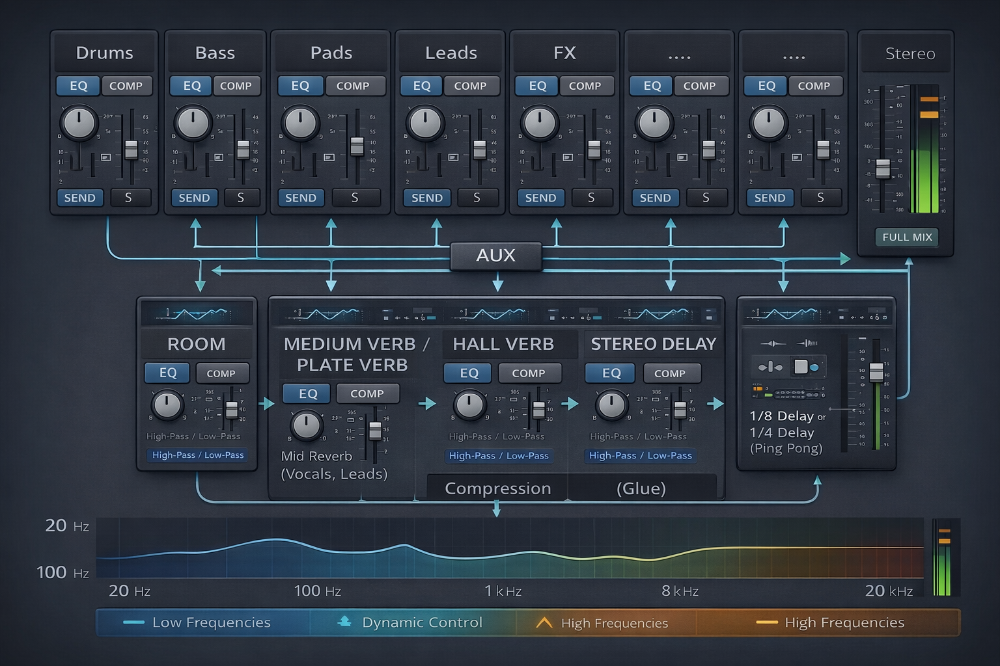

# 🎶 Miksing og mastering


Dette hefter gir en innføring og miksing og mastering. Den retter seg mot nybegynner som jobber hobbypreget og som trenger hjelp til å komme i gang, lære seg noe om teknikker, terminologi og bestandeler. Jeg er ingen ekspert. Der erfarne folk har annet å si, lytt til dem, ikke meg. Men dette heftet bør være til hjelp som utgangspunkt.

Vi jobber i Logic Pro og ser ikke på audio-problematikk eller vokal.

Med miksing mener man det å balanserer instrumentene ift. til hverandre, sørge for at de har nok luft, at de har passe relativt volum, at stereobildet og arrangement har dybde og oppleves optimalt, samtidig som man unngår clipping og har nok headroom til effektiv mastering. Mastering består i den avsluttende prosesseringen av output-lyden, hvilket inkludere arbeid med kompressorer, limiters etc. bl.a. for å øke det totale lydnivået (loudness) opp til kommersielt nivå.

Vi begynner med mastering for å se på visse ting som bør vektlegges i miksingen.

---

## Generelle tips

Det er også en del generelle tips i prosessen som er viktige:

1. Ta hyppige pauser. Ørene blir fort “blinde”. Jobb aldri lenger enn en kanskje 30–40 min før du tar en pause på 10 min. 

2. Ikke venn deg til å spille høyt i hodetelefoner. Skal man jobbe mye med musikk, vil dette være ensbetydende med tinnitus.

3. Eksporter ofte og hør på dette på andre høyttalere, i bilen osv. Problemer avsluttes ofte først da.

4. Bruk en referanselåt. Importer en profesjonell låt i samme stil inn i prosjektet. Skru den ned så den har omtrent samme nivå som egen miks og sammenlign.

---

## Mastering

En vanlig problemstilling i mastering er at man ender opp med et produkt som er altfor lavt ift. profesjonell musikk. Man må skru opp lyden nesten mot maks for at volumet skal oppleves høyt. Selv om man har lagt seg så høyt som mulig uten clipping, blir sluttresultatet pulsete. (Clipping oppstår når lydsignalet blir høyere enn det digitale maksimumsnivået (0 dBFS). Da kuttes signaltoppene, lydbølger mister form og det oppstår forvrengning).

Det man gjør i miksingen er å legge seg et godt stykke under clipping-nivået (master peaks rundt -6 dB er vanlig), for siden å stole på masteringen til å heve volumet.

I mastering i Logic Pro opererer man på på output-track'et, dvs. på Stereo Out. Man har i tillegg et master track, som er fint å bruke til fade in/fade out, men som ellers kun er for kontroll av flere output-kilder. Dvs. pugins som brukes i mastering legges etter hverandre i Stereo Out.

Det er flere plugins som kan brukes, men det helt grunnleggende (det minimale vi skal fokusere på) er:

- Channel EQ
- Compressor
- Adaptive Limiter
- Loudness Meter

Det fins også andre, som 

- saturation
- multiband compression
- stereo imaging

man kan fokusere mer på siden.

Som regel er det kun små endringer som gjøres med EQ-frekvensene i mastering, men Channel EQ er naturlig det første "boksen" på Stereo Out. Den nest, Kompressoren, komprimerer lyden (dvs. den reduserer forskjellen mellom høye og lave nivåer (dynamikken)), mens Limiter stopper peaks hardt over et bestemt nivå (som f.eks. -1 dB, men på en intelligent måte). Til slutt har vi Loudness Meter som ikke påvirker lyden, men som er en måler for opplevd lydstyrke (ift. referansepunktet på maks digitalt nivå (0 dBFS)). Med denne får man et objektiv, tallbasert mål for endelig lydstyrke som man kan styre etter.

---

### Loudness Meter

Loudness Meter kommer til slutt i kjeden, men må diskuteres først, siden den nevnes underveis i omtalen av de andre. Den gir altså et tall på lydstyrken, oppgitt i såkalte LUFS (Loudness Units relative to Full Scale). Meteret viser typisk:

- Integrated LUFS → gjennomsnittlig loudness for hele låten
- Short-term LUFS → loudness akkurat nå (målt over noen sekunder)

og tallene kan illustreres ved:

```python
-14 LUFS  → moderat loudness
-10 LUFS  → ganske høy
 -8 LUFS  → veldig høy
```

Integrated LUFS er den viktigste parameteren. Det forteller om låtens generelle lydnivå. Som referanse kan man nevne typisk lydnivå på vanlige låter på det følgende:

| Plattform   | Loudness            |
| ----------- | ------------------- |
| Spotify     | ca **-14 LUFS**     |
| Apple Music | ca **-16 LUFS**     |
| EDM         | **-8 til -10 LUFS** |

(EDM er et samlebegrep for elektronisk klubb- og dansemusikk (som house, techno, dubstep osv.))

Integrated LUFS forteller selvsagt ikke alt. De fleste låter har en naturlig dynamikk mellom rolige og intense partier. Et for konstant nivå virker flatt og livløst.

Her er en mer balansert illustrasjon:

```python
Intro       -18 LUFS
Vers        -15 LUFS
Refreng     -11 LUFS
Outro       -16 LUFS
```

---

### Channel EQ

Channel EQ er kun ment for små (typisk ±1–3 dB) avsluttende justeringer i frekvensbalansen. Store endringer endre karakteren i lyden og bør unngås, men man kan finjustere litt på midrange, justere high-pass eller low-cut etc.

---

### Compressor

I Logic Pro finnes det flere kompressor-modeller (Platinum, Studio VCA, Studio FET, Vintage Opto osv.), men de viktigste parameterne er de samme.

Det kan anbefales å begynne med 
**Platinum Digital**. Den er

- ren
- nøytral
- lett å forstå

Senere kan man eksperimentere med:

| Type       | Karakter |
| ---------- | -------- |
| Studio VCA | punchy   |

#### Viktige kompressor-parametre

📌 **Input Gain**

Input gain angir styrken på som signalet som sendes inn i kompressoren, altså nivået før kompresjonen skjer. Hvis man øker Input Gain, vil mer av signalet går over Threshold og dermed gi mer kompresjon.

📌 **Threshold**

Signal over Threshold blir komprimert, signal under påvirkes ikke. Høy Threshold tilsier f.eks. at bare de høyeste toppene komprimeres.

Eksempel:

```python
Threshold: -20 dB
```

👉 *Merk at dB i Logic Pro er dBFS (decibels full scale) der 0 dBFS er maks digitalt nivå. Dvs. at -20 dB er svakere enn f.eks. -19 dB.*

📌 **Ratio**

Ration bestemmer hvor hardt signalet presses ned over Threshold.

| Ratio | Effekt            |
| ----- | ----------------- |
| 2:1   | mild kompresjon   |
| 4:1   | vanlig kompresjon |
| 8:1   | kraftig           |
| ∞:1   | Limiter           |

Mer konkret

```python
3:1:   3 dB over Threshold → blir til 1 dB over Threshold ut
4:1:   4 dB over Threshold → blir til 1 dB over Threshold ut
```

Andre eksempler:

```python
Ratio:      3:1
Threshold: -20 dB
Input:     -17 dB (3 over)

3 dB over inn, gir 1 dB over ut (-19 dB)
```

```python
Ratio:      4:1
Threshold: -20 dB
Input:     -17 dB (3 over)

3 dB over inn, gir 3*1/4 dB = 0,75 dB over ut (-19.25 dB)
```

For en bestemt, fast Input Gain er det Threshold og Ratio som angir kompresjonsstyrke.

📌 **Attack**

Attack sier hvor raskt (i ms) kompressoren reagerer.

- rask attack → temmer transients (kick, snare)

- langsom attack → lar transienten slippe gjennom


📌 **Release**

Release angir hvor lenge (i ms) kompressoren jobber etter aktivisering før den slipper taket:

- kort → mer energi og pumping

- lang → jevnere og roligere

📌 **Makeup Gain**

Makeup Gain juster volumet opp igjen etter at kompressoren har dempet signalet. Man justerer vanligvis slik at volumet etter kompresjon matcher volumet før. Blir det økning, vil ørene lett tro på en forbedring, selv om lyden bare er høyere.

👉 *Transienter er veldig korte, plutselige topper i lydsignalet (på noen få millisekunder), vanligvis helt i starten av en lyd, som f.eks. fra en gitar eller et piano*

👉 *Flere kompressorer har en Auto Gain-checkbox som setter Makeup Gain automatisk. Mange skrur denne av for å høre virkningen av selve kompresjonen under arbeidet.*

####  Innstillinger og bruk

For det første er det bare kraftige lyder som i utgangspunktet dempes av kompressoren. Svake lyder heves ikke direkte. Men når hele lydstyrken heves i Makeup Gain, vil også det svake nivået heves og ligge nærmere det kraftige nivået enn det opprinnelig gjorde.

Her er en relativ mild kompresjon:

```python
Input Gain: 0 dB
Threshold: juster til 1–3 dB gain reduction
Ratio: 2:1
Attack: 20 ms
Release: 100 ms
Makeup Gain: +1 til +3 dB
```

hvor man for Threshold her prøver å si at man under avspilling

- justerer Threshold gradvis
- ser på Gain Reduction-måleren til den viser omtrent -1 dB til -3 dB

👉 *Gain Reduction (GR) sier hvor mange dB signalet blir dempet av prosessoren*.

👉 *Gain Reduction vises typisk sentralt i kompressorkonsollen, ofte via et nål-basert meter*

Her er en mer kraftig kompresjon:

```python
Input Gain: 0 til +2 dB
Threshold: juster til 3–6 dB gain reduction
Ratio: 4:1
Attack: 10–15 ms
Release: 80 ms
Makeup Gain: +3 til +5 dB
```

- Input Gain gis her et lett boost for mer signal over Threshold
- Threshold og ratio økes for mer kompresjon
- Attack kortes for å temme transienter mer
- Release slippes raskere for mer energi
- Makeup Gain kompenserer mer for det tapte


👉 *Når man jobber med kompresjon, er det lurt skru kompresjonen av og på for å høre virkningen tydeligere*.

👉 *Det hender man må gå tilbake og justere innstillingene når man senere jobber med Limiter. Disse må samspille, men i utgangspunktet skrus Limiter av under kompresjonseksperimenteringen*.

---

### Limiter

En limiter kan beskrives som en intelligent og kontrollert måte å stoppe topper på før de klipper. I stedet for at signalet bare blir kuttet brutalt ved 0 dBFS (hard clipping), gjør limiteren dette:

- ser transienten komme (Lookahead)

- senker nivået veldig raskt

- slipper signalet opp igjen etterpå

Resultatet er mye mindre hørbar forvrengning enn vanlig clipping.

Generelt er det tegn på en god miks at Limiter jobber lite.

Typisk:

```python
Limiter gain reduction: 1–3 dB
```

Da fanges de siste toppene, og gjennomsnittsvolumet løftes litt. Hvis Limiter isteden stadig gjør:

```python
6–10 dB gain reduction
```

kan flere ting skje:

- transienter mister punch
- lyden blir flat
- det kan oppstå pumping
- diskant kan bli hard eller sprø

Dette betyr ofte:

- miksen har for store peaks
- mye frekvenskamp
- dynamikken er ikke kontrollert tidligere
- kompressorene i miksen gjør ikke nok arbeid

Også for Limiter er det flere plugins å velge mellom. Den enkleste å starte med er Adaptive Limiter. Den har få parametre, har visuell Gain-Reduction og justerer nivået automatisk uten at man trenger å finjustere mange ting.

Andre alternativer er

- Limiter

- Multipressor
  
### Viktige parametre

📌 **Gain**

Gain øker volumet opp mot Output Ceiling. Hvis Limiter må redusere nivået for å holde signalet under grensen, vises dette som Gain Reduction. Når man skrur opp Gain, bør man følge med på Gain Reduction, gjerne vist som en vertikal bar eller en nål.

Økning av Gain:

```python
→ signalet prøver å gå over ceiling
→ Limiter presser det ned igjen
→ Gain Reduction-måleren viser hvor mye
```

📌 **Output Ceiling**

Output Ceiling et trygt maksimalt nivået for Stereo Out (ofte -0.3 dB) for å unngå clipping. Dersom Limiter er siste plugin (som påvirker lyd), vil i prinsippet ikke clipping da skje, selv om det *vil kunne* skje ved overgangen fra digitalt til analogt signal.

📌 **Lookahead**

Lookahead sier hvor langt frem Limiter ser i signalet for å forhindre at transienter klipper. Verdier på 0–5 ms er vanlig. Mer lookahead kan gi mykere lyd, men med mindre punch/energi. Ved små verdier kan  transienter bli klippet ubehandlet.

📌 **Adaptiv funksjon**

Adaptive Limiter justerer seg selv dynamisk for å hindre pumping og sikre jevn output. For nybegynnere er det lurt å velge default og heller fokusér på Gain og Output Ceiling.

####  Innstillinger og bruk

Som sagt er karakterisere Gain Reduction hvor mye Limiter jobber:

```python
1–3 dB  → lett limiting (ofte ideelt)
3–5 dB  → moderat
6 dB +  → hard limiting
```

En veldig nyttig test for en miks man kan gjøre i Logic:

- Sett Output Ceiling til -0.3 dB
- Øk Gain til ca +6 dB
- Se på Gain Reduction.

```python
1–3 dB → veldig bra miks
3–6 dB → normalt
8–10 dB → miksen er krevende
```

---

### Side Chain Compressing
 
Det er også noe som heter Side Chain Compressing. Det kan brukes som hjelp der to lyder konkurrerer om de samme frekvensene til samme tid. Kick og bass er et vanlig eksempel. Da kan man f.eks. sette opp at kompresjonen på bassen styres av kicken. Dette er veldig enkelt å få til i Logic Pro:

- Legg kompressor på bassen
- Øverst i plugin'en finnes Side Chain
- Velg kick-kanalen
- Juster Threshold og Release

---

## Miksing

Vi skal nå se på miksingen. Den starter når alt er ferdig innspilt, ferdig strukturert og man har en fungerende grovmiks.

Man setter Stereo Out fader til 0.0 dB, panorerer alle tracks til senter og starter med alle spor-volum av.

---

### Spor-volume

Volumet åpnes suksessivt igjen i følgende rekkefølge:

1. kick + bass
2. trommer
3. hovedinstrument
4. pads / atmosfære
5. voice loops / FX

Med tanke på det viktige arbeidet med EQ senere, er det fint å å separert instrumenter mest mulig, f.eks. at basstrommer og hi-hats er på separate spor, at basstangenter i en pad er på annet spor en lyse toner osv.

Ørene er beste hjelpemiddel, men la oss likevel gi noen generelle tips.

- Starte med kick-peak rundt -10 til -8 dB. Velg kick litt tydeligere enn bass.

- Lytt gjerne på litt lavere volum.
- Når miksen nesten er ferdig, dra alle faders og miks igjen veldig raskt.

Husk også å ende opp med tilstrekkelig headroom (maks -6dB på Stereo Out).

De neste stegen etter at volumene er satt, er typisk:

- Panorering
- EQ
- Kompresjon på enkeltspor
- Reverb, delay ect. (typisk på busser)
- Automatisering

La oss ta disse i tur og orden.

---

### Panorering

Noen elementer bør nesten alltid være midtstilt fordi de er fundamentet i låten.

Typisk:

- kick
- bass
- snare / clap
- hoved-lead

Disse skal gi stabilitet og punch. Instrumenter som ikke er hovedfokus kan flyttes ut til sidene.

Typisk:

- pads
- gitar
- arpeggio-synth
- hi-hats
- percussion
- atmosfæriske effekter

Dette gir mer plass i midten, større stereobilde og klarere miks. Men ikke pan alt litt. Det er gjerne bedre å være tydelig:

- 0 %
- 30–40 %
- 60–80 %

Dette gir balanse.

Hi-hats og lyse synths kan ofte panoreres ganske bredt uten problemer.

Bass og lave frekvenser bør derimot være nær midten, fordi:

- lave frekvenser fungerer dårlig i stereo
- de da fort mister kraft

Husk at panorering også kan forenkle EQ-arbeidet.

---

### EQ

EQ er ofte det mest krevende steget i miksing, men også det som gir størst forbedring når man får kontroll på det. Nøkkelen er å gjøre det systematisk og forsiktig. Her er en praktisk metode man kan følge.

To viktige regler:

1. Ikke EQ i solo for lenge: EQ skal få instrumenter til å fungere sammen, ikke alene.

2. Små endringer er ofte nok: ±1–3 dB gjør ofte stor forskjell

📌 **High-pass**

High-pass fjerner lave frekvenser, men slipper gjennom høye. Dette er ofte det første man gjør.

Mange spor inneholder unødvendig lavfrekvent energi som bare gjør miksen grumsete.

| Instrument    | High-pass  |
| ------------- | ---------- |
| vokal / loops | 80–120 Hz  |
| gitar         | 80–120 Hz  |
| synth         | 80–200 Hz  |
| pads          | 100–250 Hz |
| hi-hats       | 200–400 Hz |

La kick og bass beholde low-end. Disse tingene alene kan gjøre miksen mye klarere.

📌 **Fjern “mud”**

Det mest problematiske området i mikser er ofte området 200–500 Hz. For mye aktivitet her gir:

- grumsete lyd
- lite definisjon
- dårlig punch

Prøv små kutt: -2 til -4 dB med middels smal Q.

📌 **Finn problemfrekvenser**

En vanlig teknikk: Lag en smal EQ boost (6–8 dB), sweep gjennom frekvensene, og når noe høres stygt ut → kutt der.

Dette finner:

- resonanser
- harde frekvenser
- maskering

📌 **Lag plass mellom instrumenter**

Dette er kanskje den viktigste EQ-oppgaven.

Eksempel:

Hvis lead synth er viktig rundt 2 kHz, kan du kutte litt der i pads.


```python
lead +2 dB @ 2 kHz
pad  -2 dB @ 2 kHz
```

Dette kalles ofte complementary EQ.

📌 **Litt “presence”**

For å gjøre instrumenter tydeligere kan man booste litt i 2–5 kHz. Dette gir:

- klarhet
- attack
- definisjon

Men vær forsiktig – for mye gir hard lyd.

📌 **Luft**

High-shelf betegner det å løfte volumet til noen høye frekvenser (fra angitt verdi og oppover). Legg gjerne litt high shelf rundt 8–12 kHz. Dette kan gi litt luft og åpenhet i synths og pads, ofte bare +1 eller +2 dB

👉 *Se på Logic sin Channel EQ . Den viser litt frekvensanalyse, hvor hvor energien ligger og hvor instrumenter overlapper*.

👉 *Ikke booste mange frekvenser. Dette gir mer rot og mindre headroom. Ofte er det bedre å kutte i andre spor*.

👉 *Hvis miksen føles uklar selv etter EQ, er problemet ofte for mange lag i mid-range (300–2000 Hz) – ikke dårlig EQ*.

Har man susende pads og mange synther, kan man vurdere å dele opp akkorder mellom instrumentene (såkalt voicing) for å unngå frekvenskamp. Mange slike patcher er dessuten veldige "våte", i den forstand at de er satt opp til å låte flott alene, men mye delays, reverb, chorus og/eller andre effekter. Mye av dette er ikke nødvendig i tette partier, men viktigere er at de da bidrar til grums og frekvenskamp i mixen. Ofte kan parametre automatiseres i Logic, og hvis mulig bør man benytte tørrere lyd i tette partier.  

For nakne låter er ikke dette hovedutfordringen, men for mange amatørprosjekter er det tynne ut i lydbilde, uten å miste ønsket "trøkk" eller "punch", det kanskje mest krevende. Det å mute spor, prøve seg fram for å finne et optimalt breaking point – akkurat nok, men ikke for mye – bør prioriteres høyt.

Her har vi en liten oppdeling og karakterisering av frekvensspekteret som kan være nyttig.

| Frekvenser | Karakteristikk      | Aksjon                                            |
| ---------- | ------------------- | ------------------------------------------------- |
| 20–40 Hz   | Sub bass /rumbling  | Spiser headrom for Limiter. Gjør high pass        |
| 40–80 Hz   | Dyb bass / karakter | La gjerne én dominere (kick mer enn bass f.eks)   |
| 80–150 Hz  | Øvre bass / varme   | Rydde plass med små kutt                          |
| 150-200 Hz | Fylde /grums        | Forsiktig med EQ. Små kutt ved overvekt           |
| 200–500 Hz | Mud / grums         | Små kutt for mer definisjon / klarhet             |
| 500–900 Hz | Boxy / papp-lyd     | Små cut for mer klarhet                           |
| 2–4 kHz    | Hardhet / skarphet  | Sensitivt. + for presence, - ved hardhet/tretthet |
| 8–12 kHz   | Air / luft          | Viktig. + for åpenhet, - ved hiss /skarphet       |

Med små kutt tenker man en demping på kanskje 1-3 eller 2-4 dB.

--- 

### Track-komprimering

Kompresjon på enkeltspor er et viktig steg etter EQ i en miks. Målet er ikke nødvendigvis å “høre” kompresjonen, men å kontrollere dynamikk og gjøre spor mer stabilt i miksen. Hvis man tydelig hører kompressoren jobbe i en vanlig miks, er det ofte litt for mye.

Det er særlig bass, kick og snare som er kandidater for komprimering her. Andre instrumenter med stor dynamikk kan også være aktuelle, som akustiske gitarer, funk guitars, synth leads etc. med kraftig anslag. FX-lyder fungerer gjerne best uten komprimering.

---

### Reverbs, delays etc

Delays, reverbs og andre effekter er der for å gi rom, dybde og plassering i miksen. Dette er et viktig steg for å få en miks til å føles proff, tredimensjonal og sammenhengende.

Reverb og delay brukes først og fremst til å plassere elementer i et virtuelt rom. Enkelt sagt har man sammenhengen:    

```python
front → lite reverb
bak → mer reverb
```

Typisk har:

- vokal → lite / kontrollert reverb
- pads → mer reverb
- FX → ofte mye reverb

En vanlig feil er å bruke mange ulike reverbs. Bedre er det å lag 2–3 hovedrom på busser, f.eks:

**Room:**

- kort rom
- trommer / perk

**Plate;**

vokal / leads

**Hall:**

- pads / atmosfære, FX

Dette gjør miksen mer sammenhengende. Bass har typisk ingen (eller svært lite) reverb.

Delay kan ofte benyttes som alternativ til reverb på enkelte instrumenter. Delay kan gi romfølelse uten å gjøre miksen uklar.

Vanlige typer:

**slap delay**:

- 80–120 ms
- gir bredde og tykkelse

**tempo-sync delay**:

- 1/4 eller 1/8 note
- vanlig på leads og vokal

Delay kan ofte være renere enn reverb.

#### EQ på reverb-busser:

Reverb bør nesten alltid EQ-behandles. Typisk her er:

- High-pass: ca 150–300 Hz for å unngå muddy low-end.
- Low-pass:  ca 6–10 kHz for å gjøre rommet mer naturlig.

#### Pre-delay:

Pre-delay bestemmer hvor lenge det går før reverb starter. Det gjør at lyden kan være tydelig før rommet kommer. Denne er viktig å tilpasse.

La oss se på en mulig grovstruktur for et prosjekt som består av trommer, bass, pads, guitar, synth leads og diverse FX.

📌 **Trommer**

- Room-bus: kort reverb på snare / toms / hi-hat.
- Pre-delay: 10–30 ms for å holde punch.
- Delay brukes sjelden på trommer, med mindre du vil ha et kreativt effektløft.

📌 **Bass**

- Ofte lite til ingen reverb – bass trenger klarhet.
- Hvis du bruker reverb, high-pass EQ på bussen slik at sub-bassen ikke gjør rommet muddyt.

📌 **Pads**

- Plasser pads i Hall-bussen.
- Delay (ofte tempo-synkronisert) kan gi bevegelse.
- Reverb kan være litt lengre, men EQ for å unngå muddy low-end.

📌. **Gitar / Synth leads**

- Plate eller Room bus for vokal-lignende lead.
- Tempo-synkronisert delay gir rytmisk fylde.
- Pre-delay viktig for å beholde attack og tydelighet.

📌 **Diverse FX**

- Kan legges til i egen FX-bus med lang reverb og delay.
- Ofte automasjon på send-nivå for dynamikk.
- Bidrar til dybde og “luft” i miksen uten å drukne hovedinstrumentene.hovedinstrumentene.

Dette bildet forsøker å illustrere situasjonen:



---


### Automatisering

Automatisering hører også med til miksingen. Dette gjøres normalt sent i miksingen, ettersom de ikke like enkelt som andre ting kan modifiseres. Det påvirker mixen, så den skjer ikke nødvendigvis helt til slutt, men ting må tilpasses dynamisk i en fram og tilbake-prosess.

Ting å automatisere er

- volum på ulike spor for å å plass til ting i spesifikke partier (NB)
- effektparametre på synths
- romeffekter på busser og spor
- paning for spesielle effekter


## Annet

### Miks med alternativer

Logic Pro gjøre det lett å lage flere versjoner av et prosjekt, for alternative val for miksing og mastering (bl.a.)

Åpne 

```python
File → Project Alternatives → New Alternative
```

Gi alternativet et navn (f.eks. “Mix med split pad”) og forsøk. DEnne muligheten bør utnyttes aktivt.

---

### Trommer og loops

Loops i LOgic, særlig tromme-loops er nyttige under komposisjon og i tidlig fase av prosjektet. Men Loops er ofte ferdig prosessert og tunge å mikse, foruten at naturlig variasjon blir vanskelig-

En løsning er å konverter loop til MIDI
for å slippe å programmere alt fra scratch.

Når man ikke har nok tid eller energi til å få fram egne MIDI-baserte trommetrack, kan man automatiser litt volum på loopen, eller til og med endre timingen litt ved Flex Time / Flex Groove
