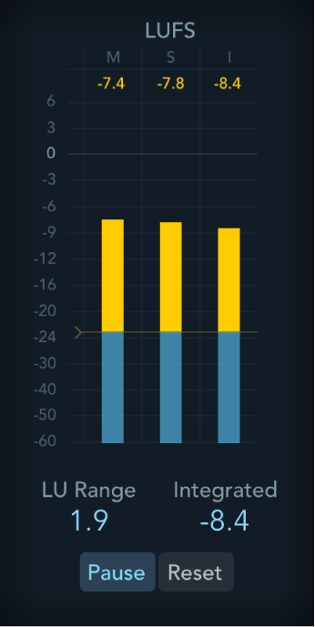
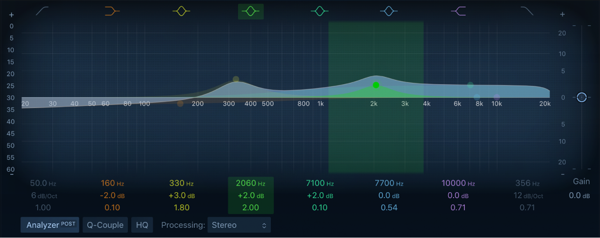
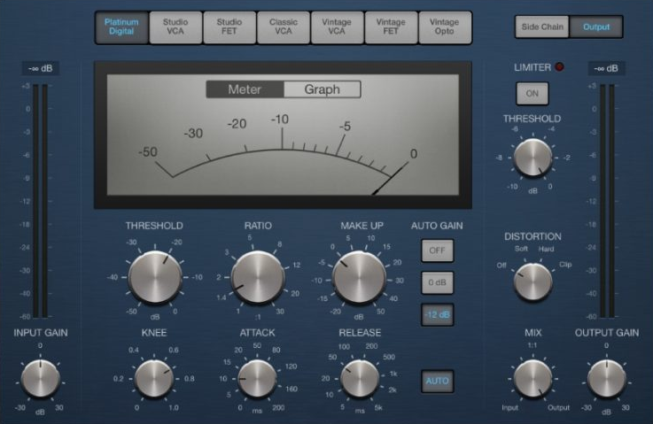
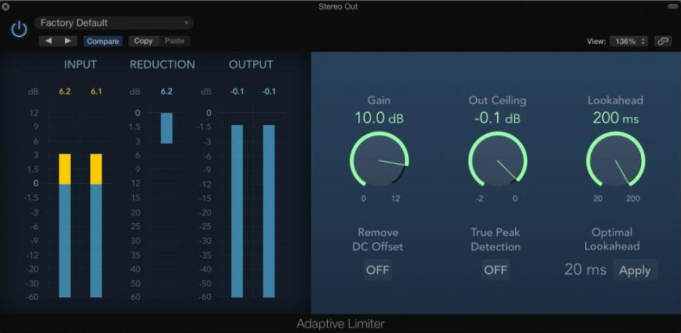
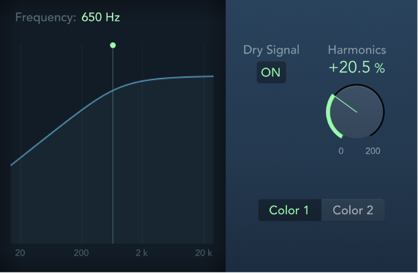
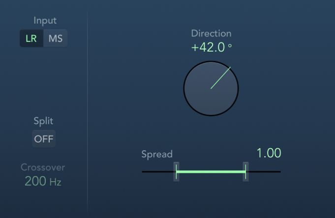

# 🎶 mixing og mastering


Dette hefter gir en innføring i mixing og mastering. Den retter seg mot nybegynner som jobber hobbypreget og som trenger hjelp til å komme i gang, lære seg noe om teknikker, terminologi og bestandeler. Jeg er ingen ekspert. Der erfarne folk har annet å si, lytt til dem. Men dette heftet kan være til hjelp som et utgangspunkt.

Vi jobber i Logic Pro og ser ikke på audio-problematikk eller vokal.

Med mixing mener man det å balanserer instrumentene ift. til hverandre, sørge for at de har nok luft, at de har passe relativt volum, at stereobildet og arrangement har dybde og oppleves optimalt, samtidig som man unngår clipping og har nok headroom til effektiv mastering. Mastering består i den avsluttende prosesseringen av output-lyden, hvilket inkludere arbeid med kompressorer, limiters etc. bl.a. for å øke det totale lydnivået (loudness) opp til kommersielt nivå.

Vi begynner med mastering for å se på visse ting som bør vektlegges i mixingen.

---

## Generelle tips

Det er også en del generelle tips i prosessen som er viktige:

1. Ta hyppige pauser. Ørene blir fort “blinde”. Jobb aldri lenger enn en kanskje 30–40 min før du tar en pause på 10 min. 

2. Ikke venn deg til å spille høyt i hodetelefoner. Skal man jobbe mye med musikk, vil dette være ensbetydende med tinnitus.

3. Eksporter ofte og hør på dette på andre høyttalere, i bilen osv. Problemer avsluttes ofte først da.

4. Bruk en referanselåt. Importer en profesjonell låt i samme stil inn i prosjektet. Skru den ned så den har omtrent samme nivå som egen mix og sammenlign.

---

## Mastering

En vanlig problemstilling i mastering er at man ender opp med et produkt som er altfor lavt ift. profesjonell musikk. Man må skru opp lyden nesten mot maks for at volumet skal oppleves høyt. Selv om man har lagt seg så høyt som mulig uten clipping, blir sluttresultatet pulsete. (Clipping oppstår når lydsignalet blir høyere enn det digitale maksimumsnivået (0 dBFS). Da kuttes signaltoppene, lydbølger mister form og det oppstår forvrengning.)

Det man gjør i mixingen er å legge seg et godt stykke under clipping-nivået (peaks rundt -6 dB på output-track er vanlig), for siden å stole på masteringen til å heve volumet.

I mastering i Logic Pro opererer man på output-track'et, dvs. på Stereo Out. Man har i tillegg et master track, som er fint å bruke til fade in/fade out, men som ellers kun er for kontroll av flere output-kilder. Dvs. pugins som brukes i mastering legges etter hverandre i Stereo Out.

Det er flere plugins som kan brukes, men det helt grunnleggende (det minimale vi skal fokusere på) er:

- Channel EQ
- Compressor
- Adaptive Limiter
- Loudness Meter

Det fins også andre, som 

- saturation
- multiband compression
- stereo imaging

man kan fokusere mer på siden.

Selv om det gjerne er lite EQ som gjøres i mastering, er likevel EQ naturlig det første "boksen" på Stereo Out. Den neste, Kompressoren, komprimerer lyden (dvs. den reduserer forskjellen mellom høye og lave nivåer (dynamikken), mens Limiter stopper peaks hardt over et bestemt nivå (som f.eks. -1 dB), men på en intelligent måte). Til slutt har vi Loudness Meter som ikke påvirker lyden, men som er en måler for opplevd lydstyrke. Med denne får man et objektiv, tallbasert mål for endelig lydstyrke som man kan styre etter.

---

### Loudness Meter

Loudness Meter kommer til slutt i kjeden, men bør diskuteres først siden et loudness-mål kreves i mastering. Meteret gir altså et tall på lydstyrken, oppgitt i såkalte LUFS (Loudness Units relative to Full Scale, 0 dBFS). Meteret viser typisk:

- Integrated LUFS → gjennomsnittlig loudness for hele låten
- Short-term LUFS → loudness akkurat nå (målt over noen sekunder)

og tallene kan illustreres ved:

```default
-14 LUFS  → moderat loudness
-10 LUFS  → ganske høy
 -8 LUFS  → veldig høy
```

Integrated LUFS er viktigste her. Det forteller om låtens generelle lydnivå. Som referanse kan man nevne typisk lydnivå på en del vanlig musikk:

| Plattform   | Loudness            |
| ----------- | ------------------- |
| Spotify     | ca **-14 LUFS**     |
| Apple Music | ca **-16 LUFS**     |
| EDM         | **-8 til -10 LUFS** |

(EDM er et samlebegrep for elektronisk klubb- og dansemusikk (som house, techno, dubstep osv.))



Integrated LUFS forteller selvsagt ikke alt. De fleste låter har en naturlig dynamikk mellom rolige og intense partier. Et for konstant nivå virker flatt og livløst.

Her er en mer balansert illustrasjon:

```default
Intro       -18 LUFS
Vers        -15 LUFS
Refreng     -11 LUFS
Outro       -16 LUFS
```

---

### EQ

Mens EQ er fundamentalt viktig på enkeltspor (for at det skal finne sin rette plass i mixen), er EQ på Stereo Out kun for små (typisk ±1–3 dB) avsluttende justeringer i frekvensbalansen. Store justeringer endre karakteren i lyden og bør unngås. Men man kan evt. finjustere litt på midrange, high-pass eller low-cut etc.



Her ser vi bare en illustrasjon av hvordan hovedvinduet ser ut.

---

### Compressor

I Logic Pro finnes det flere kompressor-modeller (Platinum, Studio VCA, Studio FET, Vintage Opto osv.), men de viktigste parameterne er gjerne de samme.

Det anbefales å begynne med **Platinum Digital**. Den er

- ren
- nøytral
- lett å forstå



Senere kan man eksperimentere med:

| Type         | Karakter  |
| ------------ | --------- |
| Studio VCA   | punchy    |
| Studio FET   | aggressiv |
| Vintage Opto | smooth    |

Men merk først at ved såkalt downward compression (som er det normale) er det bare kraftige lyder som i utgangspunktet dempes av kompressoren. Svake lyder heves ikke direkte. Men når hele lydstyrken heves i Makeup Gain, vil også det svake nivået heves og ligge nærmere det kraftige nivået enn det opprinnelig gjorde.

(Ved upward compression løftes isteden svake nivåer, mens parallell compression gjør både downward og upward compression.)

#### Kompressor-parametre

Ikke alle parametre er like viktige i starten, men vi ser litt på de fleste likevel.

📌 **Input Gain**

Input gain angir styrken på som signalet som sendes inn i kompressoren, altså nivået før kompresjonen skjer. Hvis man øker Input Gain, vil mer av signalet går over Threshold og dermed gi mer kompresjon. I en starfase er det naturlig å velge 0 (nøytral) gain.

📌 **Threshold**

Threshold er en terskelverdi. Signal over verdien blir komprimert, signal under påvirkes ikke. Høy Threshold tilsier f.eks. at bare de høyeste toppene komprimeres.

Threshold settes ikke i utgangspunktet ut fra en anbefalt verdi. Den settes isteden dynamisk slik det er forklart i kapittelet om innstillinger og bruk.

📌 **Ratio**

Ratio bestemmer hvor hardt signalet presses ned over Threshold.

| Ratio | Effekt            |
| ----- | ----------------- |
| 2:1   | mild kompresjon   |
| 4:1   | vanlig kompresjon |
| 8:1   | kraftig           |
| ∞:1   | Limiter           |

Mer konkret

```default
3:1:   3 dB over Threshold → blir til 1 dB over Threshold ut
4:1:   4 dB over Threshold → blir til 1 dB over Threshold ut
```

Eksempler:

```default
Ratio:      3:1
Threshold: -20 dB
Input:     -17 dB (3 over)

3 dB over inn, gir 1 dB over ut (-19 dB)
```

```default
Ratio:      4:1
Threshold: -20 dB
Input:     -17 dB (3 over)

3 dB over inn, gir 3*1/4 dB = 0,75 dB over ut (-19.25 dB)
```

👉 *Merk at dB i Logic Pro er dBFS (decibels full scale) der 0 dBFS er maks digitalt nivå. Dvs. at f.eks. -20 dB er 1 dB svakere enn -19 dB osv.*

For en bestemt, fast Input Gain er det primært Threshold og Ratio som angir kompresjonsstyrken.

📌 **Attack**

Attack sier hvor raskt (i ms) kompressoren reagerer.

- rask attack → temmer transients (kick, snare)
- langsom attack → lar transienten slippe gjennom

👉 *Transienter er veldig brå, kortvarig økninger i lydvolum, f.eks. fra trommer, guitar picks, vokal-konsonanter etc.*

📌 **Release**

Release angir hvor lenge (i ms) kompressoren jobber etter aktivisering før den slipper taket:

- kort → mer energi og pumping
- lang → jevnere og roligere

📌 **Knee**

Knee bestemmer hvordan kompressoren går fra ingen kompresjon til full kompresjon rundt Threshold. Ved såkalt hard knee (brå overgang) starter kompresjonen plutselig og man får en tydelig effekt som kan bidra til god punch. Medium til soft knee er gjerne å anbefale på Stereo Out.

I Platinum Digital settes verdien fra 0.0 (hard) til 1.0 (soft), og en verdi på 0.6 kan være greit for nybegynnere.

📌 **Mix**

Mix blander tørr (original) lyd med komprimert lyd. Normalt, og særlig på Stereo Out, vil man ha 100 % komprimert lyd. Blander man inn originalen kan man imidlertid opprettholde mer punch, og det kan være aktuelt på enkelte spor (kick, trommer, bass, leads etc). I en lærefase er det tryggeste å velge bare komprimert lyd.

📌 **Distortion**

Distortion legger til harmonisk forvrengning (saturation) på signalet, en form for fargelegging av lyden. Det er sjelden man vurderer det på Stereo Out, men det er noe man *kan* eksperimentere med på enkeltspor. Innstillingene kan være off, soft, hard og clip. Soft kan gi varme og fylde. Hard kan gi mer "bite" på trommer, bass etc. Clip gir mer brutale klipp for mer loudness, men også ofte fordreining av lyd.

Bass kan ha godt av litt saturation om den forsvinner litt på små høyttalere.

📌 **Makeup Gain**

Makeup Gain juster volumet opp igjen etter at kompressoren har dempet signalet. Man justerer vanligvis slik at volumet etter kompresjon matcher volumet før. Blir det økning, vil ørene lett tro på en forbedring, selv om lyden bare er høyere.

👉 *Flere kompressorer har en Auto Gain-checkbox som setter Makeup Gain automatisk. Mange skrur denne av for å høre virkningen av selve kompresjonen under arbeidet.*

#### Innstillinger og bruk

Her er en relativ mild kompresjon:

```default
Input Gain: 0 dB
Threshold: juster til 1–3 dB gain reduction
Ratio: 2:1
Attack: 20 ms
Release: 100 ms
Makeup Gain: +1 til +3 dB
```

hvor man for Threshold her prøver å si at man under avspilling

- justerer Threshold gradvis
- ser på Gain Reduction-måleren til den viser omtrent -1 dB til -3 dB

👉 *Gain Reduction (GR) sier hvor mange dB signalet blir dempet av prosessoren*.

👉 *Gain Reduction vises typisk sentralt i kompressorkonsollen, ofte via et nål-basert meter*

Her er en mer kraftig kompresjon:

```default
Input Gain: 0 til +2 dB
Threshold: juster til 3–6 dB gain reduction
Ratio: 4:1
Attack: 10–15 ms
Release: 80 ms
Makeup Gain: +3 til +5 dB
```

- Input Gain gis her et lett boost for mer signal over Threshold
- Threshold og ratio økes for mer kompresjon
- Attack kortes for å temme transienter mer
- Release slippes raskere for mer energi
- Makeup Gain kompenserer mer for det tapte

👉 *Når man jobber med kompresjon, er det lurt skru kompresjonen av og på for å høre virkningen tydeligere*.

👉 *Det hender man må gå tilbake og justere innstillingene når man senere jobber med Limiter. Disse må samspille, men i utgangspunktet skrus Limiter av under kompresjonseksperimenteringen*.

### Side Chain Compressing

Det er også noe som heter Side Chain Compressing. Det kan brukes som hjelp der to lyder konkurrerer om de samme frekvensene til samme tid. Kick og bass er et vanlig eksempel. Da kan man f.eks. sette opp at kompresjonen på bassen styres av kicken. Dette er veldig enkelt å få til i Logic Pro:

- Legg kompressor på bassen
- Øverst i plugin'en finnes Side Chain
- Velg kick-kanalen
- Juster Threshold og Release
---

### Limiter

En limiter kan beskrives som en intelligent og kontrollert måte å stoppe topper på før de klipper. I stedet for at signalet bare blir kuttet brutalt ved 0 dBFS (hard clipping), gjør Limiter dette:

- ser transienten komme (Lookahead)
- senker nivået veldig raskt
- slipper signalet opp igjen etterpå

Resultatet er mye mindre hørbar forvrengning enn vanlig clipping.

Generelt er det tegn på en god mix at Limiter jobber lite.

Typisk:

```default
Limiter gain reduction: 1–3 dB
```

Med dette menes at typisk verdi vil være dette når Limiter blinker/jobber. Man tåler at et og annet blink er høyre, f.eks. 5-6 dB, bare hovedtyngden er lavere. Da fanges de siste toppene, og gjennomsnittsvolumet løftes litt.

Hvis Limiter isteden stadig gjør:

```default
6–10 dB gain reduction
```

kan flere ting skje:

- transienter mister punch
- lyden blir flat
- det kan oppstå pumping
- diskant kan bli hard eller sprø

Dette betyr ofte:

- mixen har for store peaks
- mye frekvenskamp
- dynamikken er ikke kontrollert tidligere
- kompressorene i mixen gjør ikke nok arbeid

Også for Limiter er det flere plugins å velge mellom. Den enkleste å starte med er Adaptive Limiter. Den har få parametre, har visuell Gain-Reduction og justerer nivået automatisk uten at man trenger å finjustere mange ting.

Andre alternativer er

- Limiter

- Multipressor
  
### Viktige parametre

📌 **Gain**

Gain øker volumet opp mot Output Ceiling. Hvis Limiter må redusere nivået for å holde signalet under grensen, vises dette som Gain Reduction. Når man skrur opp Gain, bør man altså følge med på Gain Reduction, gjerne vist som en vertikal bar eller en nål.



I figuren ser vi Gain Reduction som den lille blå bar'en i midten av venstre halvdel. Den blinker tydeligvis her med en verdi på ca. 3.0 dB, mens maks-verdien så langt har vært på 6.2 dB.

Økning av Gain:

```default
→ signalet prøver å gå over ceiling
→ Limiter presser det ned igjen
→ Gain Reduction-måleren viser hvor mye
```

📌 **Output Ceiling**

Output Ceiling et trygt maksimalt nivået for Stereo Out (ofte -0.3 dB) for å unngå clipping. Dersom Limiter er siste plugin (som påvirker lyd), vil i prinsippet ikke clipping da skje (selv om det *vil kunne* skje ved overgangen fra digitalt til analogt signal).

📌 **Lookahead**

Lookahead sier hvor langt frem Limiter ser i signalet for å forhindre at transienter klipper. Verdier på 1–4 ms er vanlig. Mer lookahead, f.eks. 4-10 ms, kan gi mykere lyd, men mindre punch/energi.

📌 **Adaptiv funksjon**

Adaptive Limiter justerer seg selv dynamisk for å hindre pumping og sikre jevn output. For nybegynnere er det lurt å velge default og heller fokusér på Gain og Output Ceiling.

####  Innstillinger og bruk

Som sagt karakteriserer Gain Reduction her hvor mye Limiter jobber:

```default
1–3 dB  → lett limiting (ofte ideelt)
3–5 dB  → moderat
6 dB +  → hard limiting
```

En veldig nyttig test for en mix man kan gjøre i Logic:

- Sett Output Ceiling til -0.3 dB
- Øk Gain til ca +6 dB
- Se på Gain Reduction.

```default
1–3 dB → veldig bra mix
3–6 dB → normalt
8–10 dB → mixen er krevende
```

---

## Mixing

Vi skal nå se på mixingen. Den starter når alt er ferdig innspilt, ferdig strukturert og man har en fungerende grovmix. Man innleder med å sette Stereo Out-fader til 0.0 dB, panorerer alle tracks til senter og starter med alle spor-volum på av. (Enkelte effekter og plugins forutsetter at Stereo Out står på 0.0 dB.)

---

### Spor-volum

Volum på spor åpnes suksessivt igjen i følgende rekkefølge:

1. kick + bass
2. trommer
3. hovedinstrument
4. pads / atmosfære
5. voice loops / FX

Med tanke på det viktige arbeidet med EQ senere, er det fint å separere instrumentene mest mulig, f.eks. ha basstrommer og hi-hats på separate spor, basstangenter og lyse toner for pads i egne spor osv.

Ørene er beste hjelpemiddel, men la oss likevel gi noen generelle tips.

- Start med kick-peak rundt -10 til -8 dB. Velg kick litt tydeligere enn bass.
- Lytt gjerne på litt lavere volum.
- Når mixen nesten er ferdig, dra alle faders ned og mix igjen veldig raskt.

Husk også å ende opp med tilstrekkelig headroom (maks -6dB på Stereo Out).

De neste stegene etter at volumene er satt, er typisk:

- Panorering
- EQ
- Kompresjon på enkeltspor
- Reverb, delay ect. (typisk på busser)
- Automatisering

La oss ta disse i tur og orden.

---

### Panorering

Noen elementer bør nesten alltid være midtstilt fordi de er fundamentet i låten.

Typisk:

- kick
- bass
- snare / clap
- hoved-lead

Disse skal gi stabilitet og punch. Instrumenter som ikke er hovedfokus kan flyttes ut til sidene.

Typisk:

- pads
- gitar
- arpeggio-synth
- hi-hats
- percussion
- atmosfæriske effekter

Dette gir mer plass i midten, større stereobilde og klarere mix. Men ikke pan alt litt. Det er gjerne bedre å være tydelig:

- 0 %
- 30–40 %
- 60–80 %

Dette gir balanse.

Hi-hats og lyse synths kan ofte panoreres ganske bredt uten problemer.

Bass og lave frekvenser bør derimot være nær midten, fordi:

- lave frekvenser fungerer dårlig i stereo
- de da fort mister kraft

Husk at panorering også kan forenkle EQ-arbeidet.

---

### EQ

EQ er ofte det mest krevende steget i mixing, men også det som gir størst forbedring når man får kontroll på det. Nøkkelen er å gjøre det systematisk og forsiktig. Her er en praktisk metode man kan følge.

To viktige regler:

1. Ikke EQ i solo for lenge: EQ skal få instrumenter til å fungere sammen, ikke alene.

2. Små endringer er ofte nok: ±1–3 dB gjør ofte stor forskjell

📌 **High-pass**

High-pass fjerner lave frekvenser, men slipper gjennom høye. Dette er ofte det første man gjør. Mange spor inneholder unødvendig lavfrekvent energi som bare gjør mixen grumsete.

| Instrument    | High-pass  |
| ------------- | ---------- |
| vokal / loops | 80–120 Hz  |
| gitar         | 80–120 Hz  |
| synth         | 80–200 Hz  |
| pads          | 100–250 Hz |
| hi-hats       | 200–400 Hz |

La kick og bass beholde low-end. (Bare disse tingene alene kan gjøre mixen mye klarere.)

📌 **Fjern “mud”**

Det mest problematiske området i mixer er ofte området 200–500 Hz. For mye aktivitet her gir:

- grumsete lyd
- lite definisjon
- dårlig punch

Prøv små kutt: -2 til -4 dB med middels smal Q.

👉 *I EQ-sammenheng står Q for “Quality factor” og beskriver hvor smal eller bred frekvenskurven er rundt punktet man kutter eller løfter. Høy Q adresserer et mer spesifikt frekvensområde*.

- *Høy Q → smal kurve*
- *Lav Q → bred kurve*

📌 **Finn problemfrekvenser**

En vanlig teknikk: Lag en smal EQ boost (6–8 dB), sweep gjennom frekvensene, og når noe høres stygt ut → kutt der.

Dette finner:

- resonanser
- harde frekvenser
- maskering

📌 **Lag plass mellom instrumenter**

Dette er kanskje den viktigste EQ-oppgaven.

Eksempel:

Hvis lead synth er viktig rundt 2 kHz, kan du kutte litt der i pads.


```default
lead +2 dB at 2 kHz
pad  -2 dB at 2 kHz
```

Dette kalles ofte complementary EQ.

📌 **Litt “presence”**

For å gjøre instrumenter tydeligere kan man booste litt i 2–5 kHz. Dette gir:

- klarhet
- attack
- definisjon

Men vær forsiktig – for mye gir hard lyd.

📌 **Luft**

High-shelf betegner det å løfte volumet på noen høye frekvenser (fra angitt verdi og oppover). Legg gjerne litt high shelf rundt 8–12 kHz. Dette kan gi litt luft og åpenhet i synths og pads, ofte bare +1 eller +2 dB

👉 *Se på Logic sin Channel EQ . Den viser litt frekvensanalyse, hvor energien ligger og hvor instrumentene overlapper*.

👉 *Ikke booste mange frekvenser. Dette gir mer rot og mindre headroom. Ofte er det bedre å kutte i andre spor*.

👉 *Hvis mixen føles uklar selv etter EQ, er problemet ofte for mange lag i mid-range (300–2000 Hz) – ikke dårlig EQ*.

Har man susende pads og mange synth'er, kan man vurdere å dele opp akkorder mellom instrumentene (såkalt voicing) for lettere å unngå frekvenskamp. Mange slike patcher er dessuten veldige "våte", i den forstand at de er satt opp til å låte flott alene, med mye delays, reverb, chorus og/eller andre effekter. Mye av dette er ikke nødvendig i tette partier, men viktigere er at effektene bidrar til grums og frekvenskamp i mixen. Ofte kan parametre automatiseres i Logic, og hvis mulig bør man utnytte dette for tørrere lyd i tette partier.  

For nakne låter er ikke det nevnte hovedutfordringen, men for mange amatørprosjekter er det tynne ut i lydbilde, uten å miste ønsket "trøkk" eller "punch", det kanskje mest krevende. Det å mute spor, prøve seg fram for å finne et optimalt breaking point – akkurat nok, men ikke for mye – bør prioriteres.

Her har vi en liten oppdeling og karakterisering av frekvensspekteret som kan være nyttig.

| Frekvenser | Karakteristikk      | Aksjon                                            |
| ---------- | ------------------- | ------------------------------------------------- |
| 20–40 Hz   | Sub bass /rumbling  | Spiser headrom for Limiter. Gjør high pass        |
| 40–80 Hz   | Dyb bass / karakter | La gjerne én dominere (kick mer enn bass f.eks)   |
| 80–150 Hz  | Øvre bass / varme   | Rydde plass med små kutt                          |
| 150-200 Hz | Fylde /grums        | Forsiktig med EQ. Små kutt ved overvekt           |
| 200–500 Hz | Mud / grums         | Små kutt for mer definisjon / klarhet             |
| 500–900 Hz | Boxy / papp-lyd     | Små cut for mer klarhet                           |
| 2–4 kHz    | Hardhet / skarphet  | Sensitivt. + for presence, - ved hardhet/tretthet |
| 8–12 kHz   | Air / luft          | Viktig. ++ for åpenhet, -- ved hiss /skarphet     |

Med små kutt tenker man en demping på kanskje 1-3 eller 2-4 dB.

---

### Track-komprimering

Kompresjon på enkeltspor er et viktig steg etter EQ i en mix. Målet er ikke nødvendigvis å “høre” kompresjonen, men å kontrollere dynamikk og gjøre spor mer stabile i mixen. Hvis man tydelig hører kompressoren jobbe i en vanlig mix, er det ofte for mye.

Det er særlig bass, kick og snare som er kandidater for komprimering her. Andre instrumenter med stor dynamikk kan også være aktuelle, som akustiske gitarer, funk guitars, synth leads etc. med kraftig anslag. FX-lyder fungerer gjerne best uten komprimering.

---

### Reverbs, delays etc

Delays, reverbs og andre effekter er der for å gi rom, dybde og plassering i mixen. Dette er et viktig steg for å få en mix til å føles proff, tredimensjonal og sammenhengende.

Reverb (og tidels delay) brukes først og fremst til å plassere elementer i et virtuelt rom. Enkelt sagt har man sammenhengen:    

```default
front → lite reverb
bak → mer reverb
```

Typisk har:

- vokal → lite / kontrollert reverb
- pads → mer reverb
- FX → ofte mye reverb

En vanlig feil er å bruke mange ulike reverbs. Bedre er det å lage 2–3 hovedrom på busser, f.eks:

**Room:**

- kort rom
- trommer / perk

**Plate:**

- vokal / leads

**Hall:**

- pads / atmosfære, FX

Dette gjør mixen mer sammenhengende. Bass har typisk ingen (eller svært lite) reverb.

Pre-delay er en viktig reverb-parameter. Den bestemmer hvor lenge det går før reverb starter. Det gjør at lyden kan være tydelig før rommet kommer.

- 0-20 ms: Luft, lite rom
- 20-50 ms: Tydelighet, lite rom
- 50–100 ms: Medium rom, plate
- 100–200 ms: Dramatisk rom, stor hall

Nå benytter nok mange en av flere reverb-plugins med mange presets for ulike typer rom. Disse har bestemte default-verdier for ting som:

- Pre-delay
- Reverb time (decay)
- EQ
- Diffusjon / damping

Man kan likevel eksperimentere med pre-delay for:

- Ekstra klarhet på et instrument i miksen
- Tilpassing av reverb til tempo eller rytme

Delay kan ofte benyttes som alternativ til reverb på enkelte instrumenter. Delay er gjerne renere og kan gi romfølelse uten å gjøre mixen uklar.

Vanlige typer delay er:

**slap delay**:

- 80–120 ms
- gir bredde og tykkelse

**tempo-sync delay**:

- 1/4 eller 1/8 note
- vanlig på leads og vokal

#### EQ på reverb-busser:

Reverb bør nesten alltid EQ-behandles. Typisk her er:

- High-pass: ca 150–300 Hz for å unngå muddy low-end.
- Low-pass:  ca 6–10 kHz for å gjøre rommet mer naturlig.

La oss se på en mulig grovstruktur for dette, for et prosjekt som består av trommer, bass, pads, guitar, synth leads og diverse FX.

📌 **Trommer**

- Room-bus: kort reverb på snare / toms / hi-hat.
- Pre-delay: 10–30 ms for å holde punch.
- Delay brukes sjelden på trommer, med mindre du vil ha et kreativt effektløft.

📌 **Bass**

- Ofte lite til ingen reverb – bass trenger klarhet.
- Hvis du bruker reverb, gjør high-pass EQ på bussen slik at sub-bassen ikke gjør rommet grumsete.

📌 **Pads**

- Plasser pads i Hall-bussen.
- Delay (ofte tempo-synkronisert) kan gi bevegelse.
- Reverb kan være litt lengre, men EQ for å unngå muddy low-end.

📌. **Gitar / Synth leads**

- Plate eller Room bus for vokal-lignende lead.
- Tempo-synkronisert delay gir rytmisk fylde.
- Pre-delay viktig for å beholde attack og tydelighet.

📌 **Diverse FX**

- Kan legges til i egen FX-buss med lang reverb og delay.
- Ofte automasjon på send-nivå for dynamikk.
- Bidrar til dybde og “luft” i mixen uten å drukne hovedinstrumentene.

Dette bildet forsøker å illustrere mixingen totalt sett:


---

### Automatisering

Automatisering hører også med til mixingen. Dette gjøres normalt sent, ettersom disse ikke er enkle å modifisere. Det påvirker mixen, så den skjer ikke nødvendigvis helt til slutt, men alt må tilpasses dynamisk i en fram og tilbake-prosess.

Ting å automatisere er

- volum på ulike spor for å få bedre plass til ting i spesifikke partier (NB)
- effektparametre på synths
- romeffekter på busser og spor
- paning for spesielle effekter

## Annet

Vi har samlet diverse råd og annet i dette kapitelet. I tillegg er det flere master-plugins man kan vurdere å se på når de grunnleggende elementene beherskes. Det er ikke slik at flere master-plugins gir bedre lyd. Det vi har nevnt er det viktige. Men det er alltid nyttig å eksperimentere, og det som kan redde en låt kan ødelegge en annen.

### Exciter

En aktull plugin er Exciter. Den legger til harmoniske overtoner (ofte i high-end) for 

- mer klarhet
- mer “air”
- mer tilstedeværelse

Man har også Phat FX og Overdrive som gjør noe likende (og vi har nevnt overdrive-parameteren på kompressoren vår). Exciter er gjerne varmere, mer subtil og forbundet med mindre risiko.



Når den fungerer, gir den mer klarhet, mer definisjon og åpning i toppen. Hvis man isteden hører skarphet, spisshet (sibliance) og slitsom lyd, bør den dempes eller til og med fjernes. Som man sier:

```default
- du skal savne den når du slår den av
- ikke høre det tydelig når den er på
```

Exciter legges før Limiter i kjeden:

```default
EQ → Kompressor → Exciter → Limiter → Loudness Meter
```

Den enkleste Exciter-plugin'en i Logic har tre paramtere:

#### Frekvens (Hz)

Denne bestemmer hvor i frekvensområdet Exciter jobber.

Typiske valg:

- 3–5 kHz → presence (kan bli litt aggressivt)
- 5–8 kHz → klarhet (veldig vanlig)
- 8–12 kHz → “air” / topp

#### Harmonics (%)

Denne bestemmer hvor mye overtoner som legges til (dvs. styrken på effekten).

Typiske verdier:

- 0–10 % → veldig subtil (bra for mastering)
- 10–20 % → tydelig effekt
- over 20 % → ofte for mye på master

5-10 % kan være greit å starte med.

#### Dry Signal (On/Off)

Denne angir om originalsignalet blandes inn, hvilket det er naturlig å gjøre (ON). OFF kan fort gi kunstig lyd.

Det er også satt opp to ulike typer harmonisk karakterer: Color 1 og Color 2 (den ene gjerne noe midlere, den andre noe mer aggressiv).

Oppsummert, en trygg Exciter-start kan være:

```default
Frekvens: 7000 Hz
Harmonics: 5–8 %
Dry: ON
Color: test begge
```

### Stereo-plugins

Neste master-plugin man kan vurdere er en av flere mulige stereo-plugins, f.eks. Stereo Spread og Direction Mixer. Sistnevnte kan være et trygt valg i starten.

Den plasseres etter evt. Exciter og før Limiter:

```default
EQ → Kompressor → Exciter → Stereo → Limiter
```

Når den fungerer vil miksen åpner seg, gi mer romfølelse og mindre klumping i midten. Omvendt kan man miste fokus i midten og mixen høres kunstig bred ut når man overdriver.

Her ser vi et bilde av den og dens parametre:




#### Spread / Width

Denne sier hvor bred lyden er.

- 1.0 = normal
- 1.0 = bredere
- <1.0 = smalere

Start gjerne veldig forsiktig, med verdier som 1.0-1.2.

#### Direction (%)

Dette flytter lyden mot venstre eller høyre, og brukes nesten aldri i mastering. Velg 0% (midtstilt).

#### Input (LR / MS)

LR står for Left-Right. Her behandles venstre og høyre kanal direkte og er et naturlig startsted. MS står for Mid-Side og splitter først signalet i det som er i midten (som leads, bass og kick) og side (pads og annet). Dette gjør det mulig å påvirke bredde uten å ødelegge midten. Split ON/OFF er relatert til dette, Med split OFF påvirkes signalet samlet, og plugin'en forsøker å gjøre hele signalet bredere. Ved split ON får man to uavhengige justeringer (mid/side).

LR forsterker forskjellen mellom venstre og høyre, og MS justerer forholdet mellom mid (svakere) og side (sterkere). I en typisk mix vil mye av high-end og rom ligger i sidene, mens midten er mer low-end. Med plugin'en kan det føre til mer “luft” og detaljer. Merk at det ikke tilføres f.eks. nye overtoner eller den slags. Det eksisterende blir bare tydeligere.

Igjen kan man prøve å skru den av og på, og bare inkludere den om man savner virkningen.

Dersom avspilling i mono er relevant, bør man også kontrollere plugin'ens virkning under mono. I mange tilfeller grøter den til mono-lyden.

### Mix med alternativer

Logic Pro gjøre det lett å lage flere versjoner av et prosjekt. For å begynne på et alternativ, åpne: 

```default
File → Project Alternatives → New Alternative
```

Gi alternativet et navn (f.eks. “Mix med split pad”) og forsøk. Denne muligheten bør utnyttes aktivt.

---

### Trommer og loops

Tromme-loops er nyttige under komposisjon og i en tidlig fase av prosjektet. Men Loops er ofte ferdig prosessert og tunge å mikse (foruten at naturlig variasjon blir vanskelig).

En løsning er å konverter loop til MIDI for å slippe å programmere alt fra scratch.

En variant for de som er mer late, men som likevel ønsker variasjon eller mindre maskin-preg, er å automatiser litt volum på loopen, eller til og med endre timingen litt ved Flex Time / Flex Groove.
